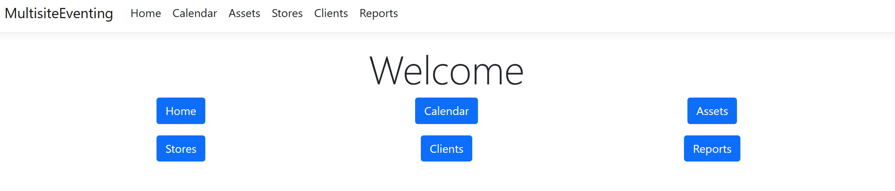
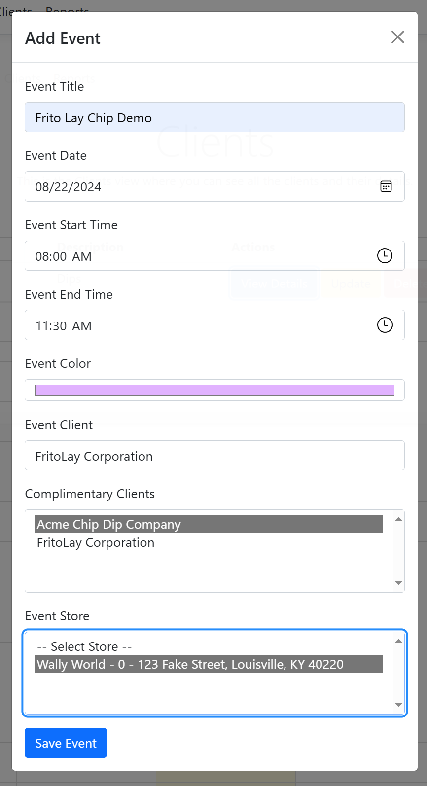
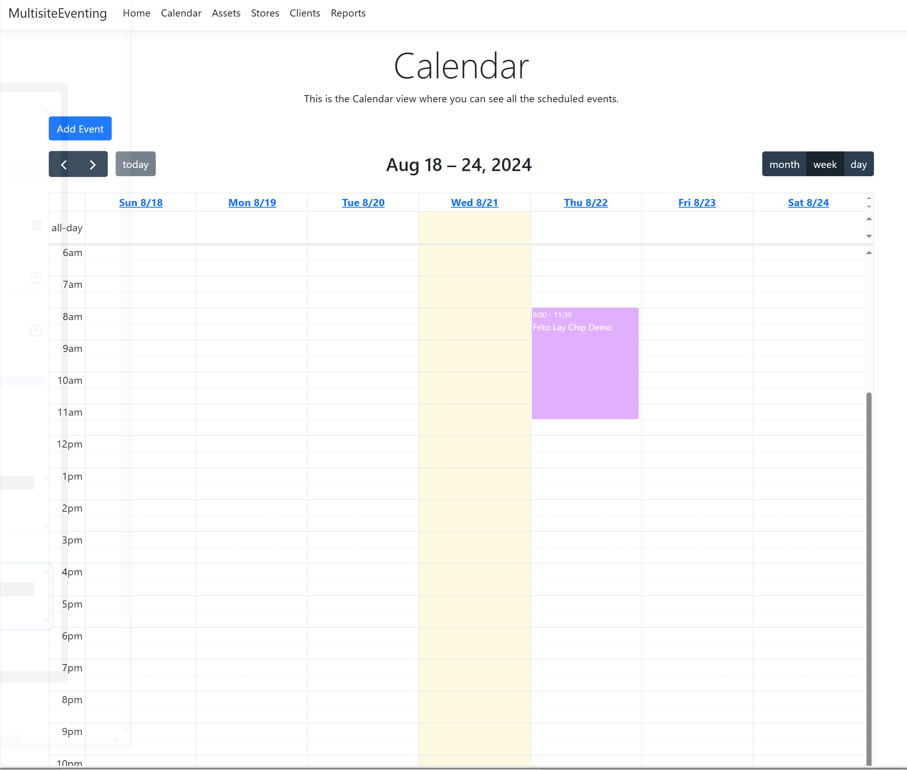
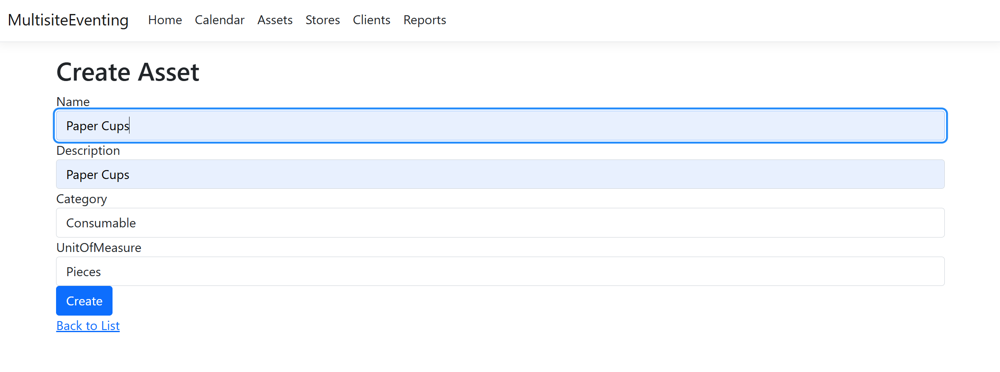
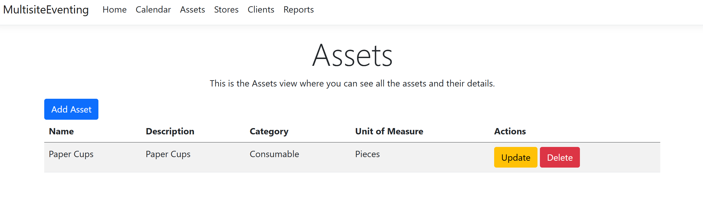
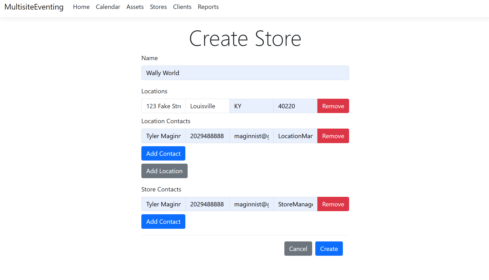
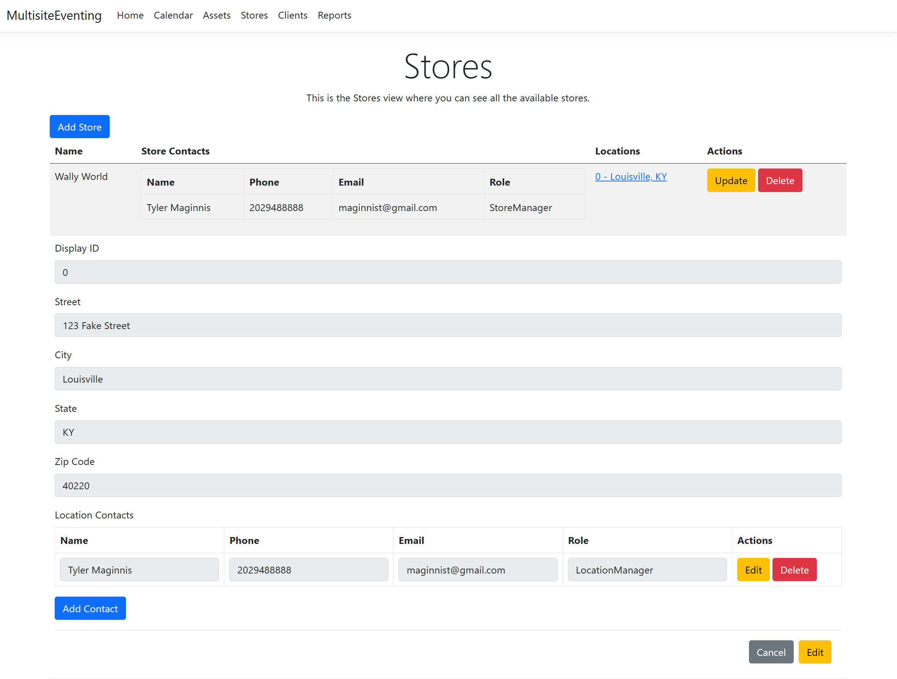
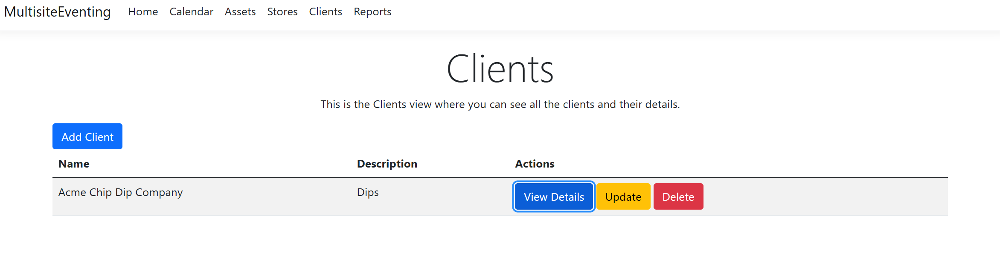

# MultisiteEventing

## Overview for Business Users

Welcome to MultisiteEventing, a powerful web application designed to streamline the management and scheduling of events across multiple locations. This user-friendly platform allows you to efficiently handle assets, clients, and stores associated with your events, ensuring a smooth and organized event planning process.

### Demo Images


*Dashboard view of MultisiteEventing.*


*Event creation interface.*


*Event calendar management interface.*


*Asset creation interface.*


*Asset management interface.


*Store creation interface.*


*Store management interface.*


*Client creation interface.*


*Client management interface.*

### Key Benefits

- **Efficient Management**: Easily create, view, update, and delete assets, clients, and stores, making event management straightforward and hassle-free.
- **Search Functionality**: Quickly find assets by name or category, saving time and improving productivity.
- **Responsive Design**: Enjoy a seamless user experience on any device, whether you're using a desktop, tablet, or smartphone.
- **Modal Dialogs**: Simplify asset updates and deletions with intuitive modal dialogs, reducing the complexity of managing your resources.
- **AJAX-Based Forms**: Experience faster form submissions for creating and updating clients without page reloads, enhancing the efficiency of your workflow.
- **Dynamic Store Management**: Add and remove store locations and contacts on the fly, providing flexibility and control over your event logistics.

## Features

- **Asset Management**: Create, view, update, and delete assets with ease.
- **Client Management**: Efficiently handle client information and interactions.
- **Store Management**: Manage store locations and contacts dynamically.
- **Search Functionality**: Locate assets quickly by name or category.
- **Responsive Design**: Access the platform on any device with a consistent user experience.
- **Modal Dialogs**: Use modal dialogs for straightforward asset updates and deletions.
- **AJAX-Based Forms**: Benefit from faster form submissions without page reloads.

## File Structure

- `Views/Assets/Create.cshtml`: View for creating a new asset.
- `Views/Assets/index.cshtml`: View for displaying and managing assets.
- `Views/Clients/Create.cshtml`: View for creating a new client.
- `Views/Clients/index.cshtml`: View for displaying and managing clients.
- `Views/Stores/Create.cshtml`: View for creating a new store.
- `.gitignore`: Specifies files and directories to be ignored by Git.
- `LICENSE`: License information for the software.

## Getting Started

To get started with MultisiteEventing, follow these steps:

1. **Clone the repository**:
    ```sh
    git clone https://github.com/yourusername/MultisiteEventing.git
    ```

2. **Navigate to the project directory**:
    ```sh
    cd MultisiteEventing
    ```

3. **Open the solution in Visual Studio**:
    ```sh
    start MultisiteEventing.sln
    ```

4. **Build and run the application**.

## License

This software is provided for demonstration purposes only and is not free for commercial use. To obtain a commercial license, please contact me at +1.202.948.888 to discuss further terms and conditions.

## Contact

For any inquiries or support, please contact:
- **Email**: maginnist@gmail.com
- **Phone**: +1.202.948.888
